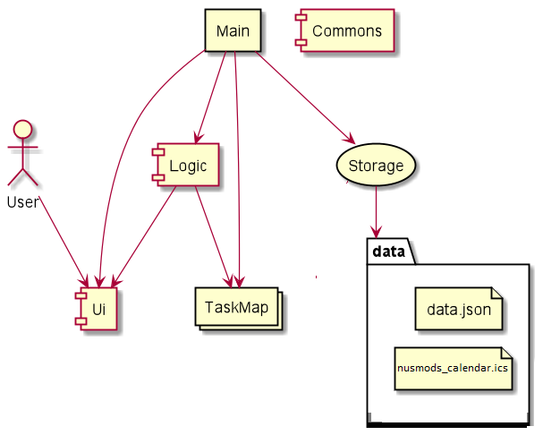
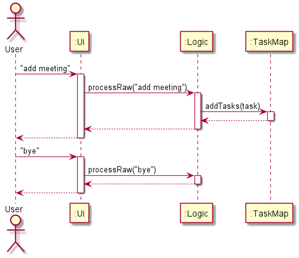

# Developer Guide

- [Design & implementation](#design--implementation)
    - [Architecture](#architecture)  
    - [Ui component](#ui-component)  
    - [Logic component](#logic-component)  
    - [Model component](#model-component)  
    - [Storage component](#storage-component)
- [Product scope](#product-scope)
    - [Target user profile](#target-user-profile)
    - [Value proposition](#value-proposition)
- [User stories](#user-stories)
- [Use cases](#use-cases)
- [Non-funcitonal requirments](#non-functional-requirements) 
- [Glossary](#glossary)
- [Instruction for manual testing](#instructions-for-manual-testing)

## Design & implementation

### Architecture

The Architecture Diagram above gives an overview of how different components interacts 
with each other in the app. 

As the app starts, the main program initialises the Ui, Logic and Storage components.
Then, the Storage component reads existing data file if it is available, else a fresh copy of 
data file is created. This step also initialises the content of runtime storage which is store 
in a TaskMap object.

Now the Ui component is ready to take inputs from the User, and the input is processed and executed
in the Logic component, the execution result is passed back to Ui component and displayed to the User.
Just before the main program exits, Storage component saves the content in the TaskMap to the data file.

Commons provide utility functions and messages to be used by other components.

The sequence diagram below shows a typical workflow the program.

In the example above, after the programs starts, User inputs "delete 2173",
the input is captured by the Ui component, then it calls the processRaw 
function from the Logic component, to extract useful information from the input. 
Logic component verified the command is valid and calls the remove function 
from the TaskMap, then TaskMap carries out the operation, and a message is
return to the Ui from the Logic component.

The next input provide by the User is "bye", it follows a similar process.
After the message is shown to the User, the main program calls the
writeTasksToFile() function in Storage and saves the data.

### Ui component

The diagram above is a class diagram of the Ui component.
Other than the usual InputStream and OutputStream, the Ui component has a
DisplayDateStructure. This abstract class prepares the content to be 
printed when the DisplayMode is WEEK or MONTH. The content is generated
using generateScreen function, which writes the intended content into
the 2-D array of characters. After that, the array will be shown to the user
by Ui class via the OutputStream. 

Moreover, WeekStructure and MonthStructure extends the DisplayDateStructure.
These classes will generate a different size of the 2-D array mentioned
in the previous paragraph due the difference in number of days displayed.

### Logic component

From the Ui component, the raw input from the User is passed to the Parser class.
Parser class will process and validate the input, then it generates a specific
command accordingly.  Specific commands extends from the abstract Command class.
Command operates on the TaskMap and execution of Command generates a 
CommandResult. This CommandResult is passed back to the Ui component and 
respective content will be displayed to User based on the CommandResult. 

### Model component

Task class consists of attributes like description, date, start time, end time,
priority that are important to users. Whereas other attributes like 
HASH_VALUE_DIGITS, taskID and internal values of Priority enum class matters
more to developers. For example, the HASH_VALUE_DIGITS and the color code of 
Priority could affect the content displayed to User, and the reason why the
constant 4 is used will be explained in the next paragraph. 

TaskMap is the container used for runtime storage, it stores up to 10000 Task
objects. The number 10000 is chosen such that the unique identifier of each
Task is kept within 4 digits. Keeping it to 4 digits allows the app to have a
better displaying effect.

The underlying data structure used for TaskMap is the Java LinkedHashMap.
It is chosen because it allows efficient access to an element (Task) using the
unique identifier (Integer). Another reason of using LinkedHashMap is because 
it is ordered, this allows the container to be sorted. DateSorter and 
PrioritySorter implements the Task comparator, they are used in the TaskMap
functions sortByDate() and sortByPriority().

### Storage component

At the initiating and closing stage of the program, the Storage component
will read and write to the data file respectively. As shown in the diagram
above, the data file is named as "data.json" and placed under a folder called
"data". The Storage component also uses the Google Gson library to convert Task
object to and from json format. For example, in the process of saving to file,
each Task object is convert to json string and then writes to file via FileWriter. 

### Common classes

Common classes provide utility functions and string messages used by multiple components,
and these classes are stored in the seedu.commons package.

## Product scope

### Target user profile

    - Students in general
    - Owns a personal laptop/PC
    - Willing to use command line app for planning

### Value proposition

    PlaNUS is a one stop location for students to be able to view all their 
    commitments and assignments, and prioritize their work and commitment 
    with a user-friendly text interface.

## User Stories

|Version| As a ... | I want to ... | So that I can ...|
|--------|----------|---------------|------------------|
|v1.0|Forgetful student|add tasks to list|keep track of them and not forget it|
|v1.0|Busy student|modify existing tasks|don't waste time deleting and adding it all over again|
|v1.0|New user|see instructions|have quick access to the instruction w/o having to access the user guide|
|v1.0|Student with many different tasks & due dates|set task priority|focus on more urgent tasks |
|v1.0|Student with many different tasks & due dates|sort tasks by priority|clearly view of tasks urgency|
|v1.0|Student with many tasks|search for tasks|find what i want quickly|
|v1.0|Student with many tasks|delete tasks|old tasks don’t clutter up the display|
|v1.0|Busy student|clear all tasks|don’t waste time deleting one by one|
|v2.0|Busy student|View tasks in a weekly and monthly view|I know what i have due for that time period|

## Use cases

### Use case: Add task

User adds a task
PLANus adds task
PLANus shows the task added message

Use case ends. 

Extensions
      1a. User adds task without any date
Date is set to the current date
      1b. User adds tasks without any priority
Priority is set to low
      1c. User adds task without start and end time
Time is set to empty
      1d. User inputs wrong details format
PLANus shows invalid command message

### Use case: List task
User requests to list tasks
PLANus shows tasks

Use case ends.

Extensions
      2a. List is empty - PLANus displays empty list

Use case: Edit task
User inputs the task index, and what user wants to change
PLANus changes the task details
PLANus shows the task edited message. 

Use case ends.

Extensions
      1a. User inputs an invalid index
Shows invalid command message
      1b. User inputs wrong details format
Shows invalid command message

### Use case: Help
User inputs help command
PLANus displays help message

Use case ends.

### Use case: Search
User inputs search command with keyword
PLANus searches the task list for keyword
PLANus displays results

Use case ends.

Extensions
      2a. PLANus is unable to find any matches
Shows no tasks found message

### Use case: Delete
User inputs delete command with index
PLANus deletes the task
PLANus shows task deleted message

Use case ends.

Extensions 
      1a. User inputs invalid index
PLANus shows invalid task number message

### Use case: Clear 
User inputs clear command
PLANus clears all tasks
PLANus shows tasks cleared message

Use case ends. 

## Non-Functional Requirements

    - The system should respond within two seconds.
    - The system should be easy to use, do not require much effort to learn.
    - Features should be able to be implemented before project deadline.

## Glossary

## Instructions for manual testing

